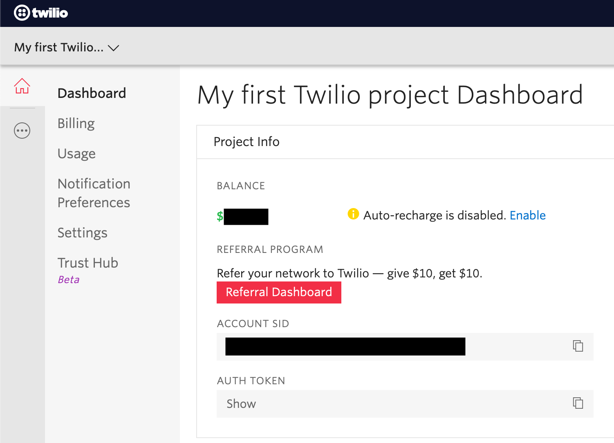

# SMSender

## Overview

 A python script to automate sending SMS to a large group of people.
 This script uses the twilio framwork to send the text messages.
 Twilio provides an easy to use API to send and recieve messages at scale.
 I have no affiliation with Twilio, I am just a customer and I like the product.

 The script has a `format_number` function that checks the format of the phone number using regex and changes the edits the phone number to be in the correct format. You may need to edit this function depending on where you send you texts to. 

 You can even change the name that will appear as the sender!

## Before running the script:

You must register at the twilio website. 
You can help me out and register at this referral link www.twilio.com/referral/TsQihR :)

After registering, you need to add funds to your account to be able to send text messages. 
Pricing depends on where your recipients reside, so check it out on Twilio website.

Before going forward, write down your ACCOUNT SID and AUTH TOKEN that appear in your Twilio Dashboard

### Fill Excel

Fill up the included `SMSList.xlsx` file with the names and phone numbers of the people you want to send your text messages to.

After running the script, you can go back to the file and see if the message was send successfully and what is the SID of each text message sent. 

If the script encountered an error, it will also be added to the excel file. 

## How to use?

1. Clone this repository and run `pip3 install -r requirements.txt`

2. Fill in the `SMSenderData.py` file with the required information.

sid -> your ACCOUNT SID\
token -> your ACCOUNT TOKEN\
excel -> the path to your excel file. If you use the one provided, leave as is\
from_ -> the name of the sender that will appear when recieving the message\
body -> the body of the message

3. Run the script.
